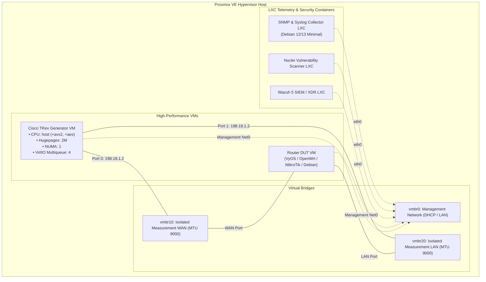

# Proxmox VE Automation & Lab Helper Scripts 🚀

[](https://opensource.org/licenses/MIT)
[](https://www.proxmox.com)
[](https://www.debian.org)
[](https://www.gnu.org/software/bash/)

A production-ready toolkit of automated deployment scripts, LXC container builders, high-performance VM provisioning helpers, and hypervisor tuning configs for **Proxmox Virtual Environment (PVE 8.x / 9.x)**.

---

## 📋 Table of Contents

- [Overview](#overview)
- [Architecture & Lab Topology](#architecture--lab-topology)
- [Repository Structure](#repository-structure)
- [Security & Environment Variables (.env)](#security--environment-variables-env)
- [Included Scripts & Components](#included-scripts--components)
  - [1. Virtual Machines (vms/)](#1-virtual-machines-vms)
  - [2. LXC Containers (ct/)](#2-lxc-containers-ct)
  - [3. Guest Appliance Installers (install/)](#3-guest-appliance-installers-install)
  - [4. Multi-Node Distributed Deployments (distributed/)](#4-multi-node-distributed-deployments-distributed)
  - [5. System Tuning & DPDK Utilities (system-config/)](#5-system-tuning--dpdk-utilities-system-config)
- [Getting Started](#getting-started)
- [Hypervisor Tuning Guide](#hypervisor-tuning-guide)
- [Contributing & License](#contributing--license)

---

## 🌐 Overview

This repository provides modular, idempotent scripts designed to streamline deployment of:
- **High-Throughput Traffic Generators** (Cisco TRex line-rate packet generator with DPDK and NUMA optimizations)
- **Network Devices Under Test (DUT)** (VyOS, OpenWrt, MikroTik RouterOS v7 CHR, Debian routing nodes)
- **Telemetry & Monitoring** (SNMP trap/polling and Syslog collectors)
- **Automated Security Auditing** (ProjectDiscovery Nuclei scanner LXC)
- **Enterprise SIEM & XDR** (Wazuh 5 Beta All-in-One LXC and distributed cluster setup)

---

## 🏗️ Architecture & Lab Topology



---

## 📁 Repository Structure

```text
proxmox-scripts/
├── .env.example              # Configuration template for credentials, bridges, and storage
├── .gitignore                # Strictly excludes .env and secret files
├── LICENSE                   # MIT License
├── README.md                 # Project documentation and quickstart
├── docs/
│   └── PROXMOX_GUIDE.md      # Comprehensive PVE hypervisor DPDK/SR-IOV tuning guide
├── vms/
│   ├── create_trex_vm.sh     # Deploy Cisco TRex generator VM with Cloud-Init & DPDK tuning
│   └── create_dut_vm.sh      # Deploy Router DUT VM (VyOS, OpenWrt, MikroTik, Debian)
├── ct/
│   ├── create_snmp_lxc.sh    # Deploy SNMP & Syslog Telemetry Collector LXC
│   ├── create_nuclei_lxc.sh  # Deploy ProjectDiscovery Nuclei Scanner LXC
│   └── wazuh.sh              # Deploy Wazuh 5 Beta All-in-One LXC (Community Scripts style)
├── install/
│   ├── install_trex.sh       # TRex DPDK installation & systemd daemon setup (runs inside VM)
│   ├── install_snmp_collector.sh # SNMP daemon & syslog poller setup (runs inside LXC)
│   ├── install_nuclei.sh     # Nuclei scanner & templates setup (runs inside LXC)
│   └── wazuh-install.sh      # Wazuh 5 container install assistant (runs inside LXC)
├── distributed/
│   └── wazuh5-distributed.sh # Multi-node Wazuh 5 cluster installer (Indexer, Manager, Dashboard)
└── system-config/
    ├── dpdk-bind.sh          # Automated DPDK driver binding utility (vfio-pci / uio_pci_generic)
    ├── cpu-affinity.conf     # CPU pinning and core isolation settings
    ├── grub-tuning.conf      # Linux kernel boot parameters (isolcpus, default_hugepagesz)
    ├── hugepages.conf        # Hugepages allocation configuration
    ├── trex.service          # Systemd unit file for TRex server daemon
    ├── trex_cfg.yaml.template # TRex dual-port DPDK configuration template
    ├── trex_sriov.yaml       # Hardware SR-IOV configuration profile
    └── trex_virtio.yaml      # VirtIO software-emulated configuration profile
```

---

## 🔐 Security & Environment Variables (.env)

> [!IMPORTANT]
> **Never commit your `.env` file to Git!**
> This repository includes `.env` and all credential patterns in `.gitignore`. Real credentials, IP addresses, and custom hypervisor settings should strictly reside in your local `.env`.

To configure your environment defaults:

1. Copy the provided template:
   ```bash
   cp .env.example .env
   ```
2. Edit `.env` with your preferred settings:
   ```bash
   nano .env
   ```
3. All deployment scripts automatically detect and source `.env` if present, falling back to sensible interactive defaults if omitted.

---

## 💻 Included Scripts & Components

### 1. Virtual Machines (`vms/`)

- **`vms/create_trex_vm.sh`**:
  - Automatically downloads Debian 13 (Trixie) generic cloud image (`qcow2`).
  - Configures optimal KVM flags for DPDK: `--cpu host,flags=+aes;+avx;+avx2`, `--numa 1`, `--hugepages 2`.
  - Provisions 3 network interfaces: Out-of-band management (`vmbr0`) and dual test interfaces (`vmbr10`, `vmbr20`) with VirtIO multiqueue.
  - Generates isolated measurement bridges (`vmbr10`, `vmbr20`) with 9000 MTU if not already present.
  - Provisions Cloud-Init credentials and expands storage to 32 GB.

- **`vms/create_dut_vm.sh`**:
  - Interactive Whiptail menu to choose target router OS: **VyOS**, **OpenWrt**, **MikroTik CHR**, or **Debian**.
  - Wires interfaces directly into the isolated measurement test loop (`vmbr10` = WAN, `vmbr20` = LAN).

### 2. LXC Containers (`ct/`)

- **`ct/create_snmp_lxc.sh`**:
  - Provisions an unprivileged Debian LXC container on Proxmox.
  - Automatically pushes and executes `install/install_snmp_collector.sh`.
  - Configures SNMPv2c/SNMPv3 trap receiver on port 162/UDP and Syslog receiver on port 514.

- **`ct/create_nuclei_lxc.sh`**:
  - Provisions an unprivileged Debian LXC container for vulnerability assessment.
  - Automatically pushes and executes `install/install_nuclei.sh`.
  - Installs official ProjectDiscovery templates and provides `scan_router.sh` wrapper.

- **`ct/wazuh.sh`**:
  - Wazuh 5 Beta All-in-One LXC installer following the official **Proxmox Community Helper Scripts** standard.
  - Automatically detects the newest available Ubuntu template or allows choosing Ubuntu 24.04 LTS.

### 3. Guest Appliance Installers (`install/`)

- **`install/install_trex.sh`**: Full automated Cisco TRex v3.08 installer for Debian 13 guests. Installs DPDK dependencies, downloads official releases, prepares Python virtual environments, and installs `trex.service`.
- **`install/install_snmp_collector.sh`**: Complete SNMP & Syslog daemon configuration with Python background poller.
- **`install/install_nuclei.sh`**: Automated binary installer for ProjectDiscovery Nuclei and template updater.
- **`install/wazuh-install.sh`**: Internal container setup runner for Wazuh 5 Beta.

### 4. Multi-Node Distributed Deployments (`distributed/`)

- **`distributed/wazuh5-distributed.sh`**:
  - Automated deployment of enterprise multi-node Wazuh 5 Beta clusters across 3 dedicated LXC containers:
    - Container 1: **Wazuh Indexer** (Elasticsearch/OpenSearch compatible data node)
    - Container 2: **Wazuh Manager** (Core SIEM/XDR analysis engine)
    - Container 3: **Wazuh Dashboard** (Web GUI and analytics visualization)
  - Handles cluster token generation, certificate exchange, and automated cross-node verification.

### 5. System Tuning & DPDK Utilities (`system-config/`)

- **`system-config/dpdk-bind.sh`**: Bind and unbind network cards to DPDK user-space drivers (`vfio-pci`, `uio_pci_generic`) with safe fallback for non-IOMMU hypervisors.
- **GRUB & Kernel configs**: Pre-configured isolcpus, hugepage allocations (2M and 1G), and NUMA pinning definitions.

---

## 🚀 Getting Started

### Prerequisites
- A running **Proxmox VE 8.x or 9.x** host node.
- Root shell access (SSH or PVE Web UI console).

### Quickstart Execution on Proxmox Node

1. **Clone the repository on your Proxmox host:**
   ```bash
   git clone https://github.com/hubertges/proxmox-scripts.git
   cd proxmox-scripts
   ```

2. **Configure environment settings (optional):**
   ```bash
   cp .env.example .env
   nano .env
   ```

3. **Deploy Cisco TRex Generator VM:**
   ```bash
   bash vms/create_trex_vm.sh
   ```

4. **Deploy Router DUT VM:**
   ```bash
   bash vms/create_dut_vm.sh
   ```

5. **Deploy SNMP Telemetry Collector LXC:**
   ```bash
   bash ct/create_snmp_lxc.sh
   ```

6. **Deploy Wazuh 5 All-in-One LXC:**
   ```bash
   bash ct/wazuh.sh
   ```

---

## 📖 Hypervisor Tuning Guide

For detailed technical guidelines on DPDK line-rate benchmarking, SR-IOV PCIe Passthrough, VirtIO multiqueue optimizations, and NUMA memory pinning, refer to:
👉 **[PROXMOX_GUIDE.md](docs/PROXMOX_GUIDE.md)**

---

## 📄 License

This project is licensed under the **MIT License** - see the [LICENSE](LICENSE) file for details.
